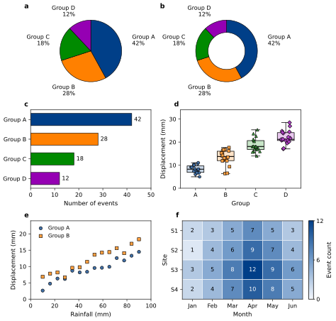

# EngGeo Figure v1.0

Personal Python/Matplotlib figure skill for engineering geology, geotechnics and landslides. Replaces `geology-figure`; invoke as `$enggeo-figure`.

## Current conventions

- Content-sized layouts, including arbitrary rows × columns; 89/180 mm are reference widths, not mandatory widths.
- Measure decorated content gaps: normally 2–3 mm (target 2.5 mm). Audit alignment separately. Include twins, legends and colour bars; resize the canvas after compacting.
- DejaVu Sans first, Arial second; black ordinary text. Ticks 8 pt, axis labels 8.5–9 pt, panel letters 9.5–10 pt. These already include the agreed 1 pt increase.
- Deep blue `#003F88` and saturated category colours with stable variable mappings; no fixed hazard-colour semantics.
- Outward ticks, boxed Cartesian axes, no default grid, no titles or footer notes.
- Markers: black 0.6 pt edges, opaque fills with 25% white mixed into the series colour; ordinary size 4–5 pt.
- Dual/triple axes colour-match variable labels, ticks and corresponding spine. Pie/donut charts use flat circles and external readable labels.
- Editable SVG only by default, white background, tight artwork bounds with 1.5 mm padding. Other formats require an explicit request.
- Preserve supplied data; clearly identify synthetic demonstrations outside the figure.

## Install and verify

Place this repository in `~/.codex/skills/enggeo-figure/`. Archive the previous `geology-figure` folder outside the skills directory to avoid duplicate discovery.

```bash
python -m pip install -r requirements.txt
python scripts/calibration_demo.py --output examples/generated
```

`SKILL.md` is the entrypoint; `references/style-contract.md` owns visual rules. `scripts/enggeo_style.py` supplies styling, marker, multi-axis, alignment, spacing and export helpers. The calibration script exports an SVG, synthetic source data and measured QA records.

## Synthetic calibration example



This preview contains generated demonstration data only; it is not scientific evidence.
